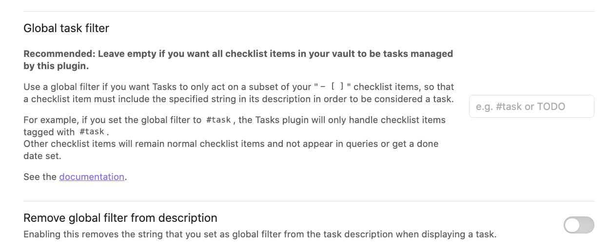

# Global Filter

## Optional Global Filter

You can set a global filter in the settings so that Tasks only matches specific checklist items.
For example, you could set it to `#task` to only track checklist items as task if they include the string `#task`.
It doesn't have to be a tag. It can be any string.
Leave it empty to regard all checklist items as tasks.

Example with global filter `#task`:

```markdown
- [ ] #task take out the trash
```

If you don't have a global filter set, all regular checklist items will be considered a task:

```markdown
- [ ] take out the trash
```

> [!warning]
> If you use a tag such as `#task` as the global filter, you cannot add sub-tags to that tag.

## Settings for the Global Filter

The following settings in the Tasks Options pane control the vault's global filter.

Note you must restart Tasks after changing any settings here.



Image of the settings options for the global filter, showing the default settings.

---

## View this page on the old documentation site

> [!Info] Request for feedback
> This page is an experimental migration of the Tasks user docs to Obsidian Publish. When the conversion is good enough, this will become the live site.
>
> For comparison, you can view [this page on the old documentation site](https://obsidian-tasks-group.github.io/obsidian-tasks/getting-started/global-filter/).

> [!Bug] Please report any problems
>
> We are keeping a list of [[migration#Current Status and Known Problems|Known Problems]] with the conversion.
>
> If you notice any other problems in this page, compared to the old one, please let us know in [#1706](https://github.com/obsidian-tasks-group/obsidian-tasks/issues/1706#issuecomment-1454284835).
>
> Please include:
>
> - The URL of the problem page
> - A screenshot of the problem.
>
> Thank you!
