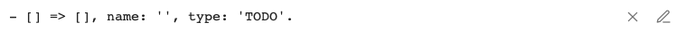
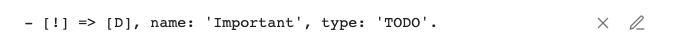
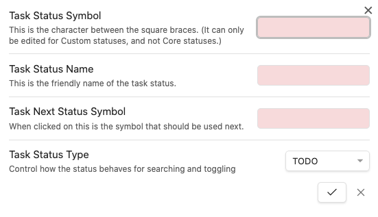
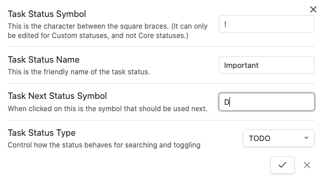

# Editing a Status

## Overview

This page describes features of the modal used for editing a Status.

You open the modal by clicking Pencil icon to the right of any of your statuses, in the Tasks Settings:

 
*Above: Sample empty status row in Settings, with Pencil icons at the right.*

<!--
 
-->

## Editing the Status

When you edit a new task status, the modal looks like this:

Notice the red colouring, to indicate values which are not yet valid.

If you aren't sure why something is invalid, click on the Checkmark button and an explanatory notice will pop up for a few seconds. Or see below.

1. Click on the pencil icon
    - This will open the status edit modal.
    - Notice the red colouring, to indicate values which are not yet valid.
    - If you aren't sure why something is invalid, click on the Checkmark button and an explanatory notice will pop up for a few seconds.

## Saving the Status

Once you have added or edited the desired information, and none of the fields are red, you can click on the Checkmark to save the Status.

## Validation

Red warnings will be shown if any of the following checks are not satisfied:

- The two Symbol values must be a single character.
- The Name cannot be empty.

## Limitations and Issues

- Currently hitting Return to save changes and close the modal only works if you Tab through all the values until the Checkmark button has focus.

---

## View this page on the old documentation site

> [!Info] Request for feedback
> This page is an experimental migration of the Tasks user docs to Obsidian Publish. When the conversion is good enough, this will become the live site.
>
> For comparison, you can view [this page on the old documentation site](https://obsidian-tasks-group.github.io/obsidian-tasks/getting-started/statuses/editing-a-status/).

> [!Bug] Please report any problems
>
> We are keeping a list of [[migration#Current Status and Known Problems|Known Problems]] with the conversion.
>
> If you notice any other problems in this page, compared to [the old one](https://obsidian-tasks-group.github.io/obsidian-tasks/getting-started/statuses/editing-a-status/), please let us know in [#1706](https://github.com/obsidian-tasks-group/obsidian-tasks/issues/1706#issuecomment-1454284835).
>
> Please include:
>
> - The URL of this problem page
> - A screenshot of the problem.
>
> Thank you!
