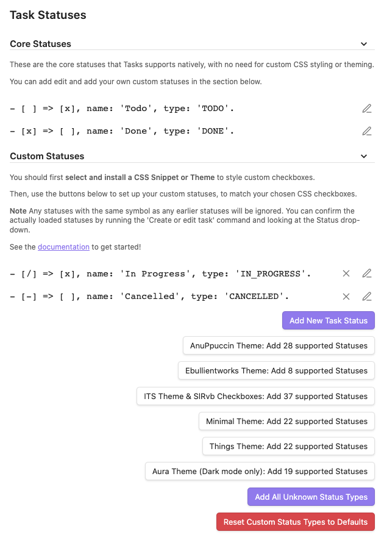

# Set up custom statuses

## Motivation

This page shows you how to customise the statuses used in your Tasks vault, once you have decided which letters and symbols inside `[` and `]` you wish to use, and what they should be called.

### Core (Built-in) statuses

As installed, the Tasks plugin supports just two statuses for your tasks:

```text
- [ ] I am a TODO task that is not yet done
- [x] I am a DONE task that has been done
```

- Clicking on a TODO task converts it to DONE
- Clicking on a DONE task converts it to TODO

### Custom statuses

Many users would like to represent other statuses, such as Cancelled, Delegated, Blocked and many more.

> [!success] Released
Custom statuses were introduced in Tasks 1.23.0.

Tasks now allows you to add custom statuses to your settings, to give you powerful control over what happens next when you click on the task's checkbox.

## Task Statuses Settings

This is what you see in the Tasks settings when you first look at the Task Statuses section:



You can read about it in [Status Settings]({{ site.baseurl }}).

---

## Example: Add a set of high priority statuses

### Goal

Suppose that you wanted to create a set of 3 statuses that cycle between each other, perhaps to make important tasks stand-out from everything else:

<!-- placeholder to force blank line before included text --> <!-- include: DocsSamplesForStatuses.test.DefaultStatuses_important-cycle.approved.md -->

| Status Symbol | Next Status Symbol | Status Name | Status Type | Needs Custom Styling |
| ----- | ----- | ----- | ----- | ----- |
| `!` | `D` | Important | `TODO` | Yes |
| `D` | `X` | Doing - Important | `IN_PROGRESS` | Yes |
| `X` | `!` | Done - Important | `DONE` | Yes |

<!-- placeholder to force blank line after included text --> <!-- endInclude -->

### The Steps

1. Open the Tasks settings pane
1. Scroll down and click on 'Add New Task Status'
    - This will create a new, empty status:
    - 
1. Click on the pencil icon
    - This will open the [status edit modal]({{ site.baseurl }}).
    - Notice the red colouring, to indicate values which are not yet valid.
    - If you aren't sure why something is invalid, click on the Checkmark button and an explanatory notice will pop up for a few seconds.
    - 
1. Enter the desired values (see the table in Goal above):
    - 
1. Click on the Checkmark button to save the new status, and view the result:
    - 
1. Repeat for the other two statuses in Goal above and you should see a clear reflection of the flow of your new statuses
    - `[!]` -> `[D]` -> `[X]` -> `[!]`:
    - 

> [!info]
> The status changes are applied to newly edited tasks and subsequently opened notes immediately.
>
> Whilst experimenting and setting up your statuses, you do not need to restart Obsidian, unless you want to make Tasks re-read all the tasks in your vault, for example so that searches are aware of the changed statuses.
>
> Once you are happy with your statuses, we recommend restarting Obsidian, to ensure that all tasks and query results use the correct settings.

> [!warning]
Tasks currently allows creation of more than one status with the same symbol. It silently ignores any duplicate symbols: only the first will be used. If in doubt, examine the available statuses in the status dropdown in the [‘Create or edit Task’ Modal]({{ site.baseurl }}).

### Test the new statuses

Now you can create use the [‘Create or edit Task’ Modal]({{ site.baseurl }}) to create a new task and set its status:


Create an important task:

```text
- [!] #task Do important stuff
```

Switch to Reading mode.
Then click the checkbox for the above task.
It becomes:

```text
- [D] #task Do important stuff
```

Repeat - note the capital `X`:

```text
- [X] #task Do important stuff ✅ 2023-01-09
```

Repeat again:

```text
- [!] #task Do important stuff
```

## Adding more statuses

[Bulk-adding Statuses]({{ site.baseurl }}#bulk-adding-statuses) shows various ways of quickly adding large numbers of statuses in single steps.

## Related pages

<!-- force a blank line --> <!-- include: snippet-statuses-overview.md -->

> [!info]
> Broad steps to understand and set up Statuses (or "Alternate Checkboxes"):
>
> - Understand what Statuses are:
>   - [Statuses]({{ site.baseurl }})
>   - [Custom Statuses]({{ site.baseurl }})
> - Choose your status styling scheme: this will determine the names and symbols for your custom statuses:
>   - Some common ones are shown in [Status Collections]({{ site.baseurl }})
> - Set up your status styling scheme
>   - [How to style custom statuses]({{ site.baseurl }}).
> - Configure Tasks to use your custom statuses
>   - [How to set up your custom statuses]({{ site.baseurl }})
> - Optionally, update your tasks searches to take advantage of the new flexibility
>   - [Filters for Task Statuses]({{ site.baseurl }}#filters-for-task-statuses)

<!-- force a blank line --> <!-- endInclude -->
