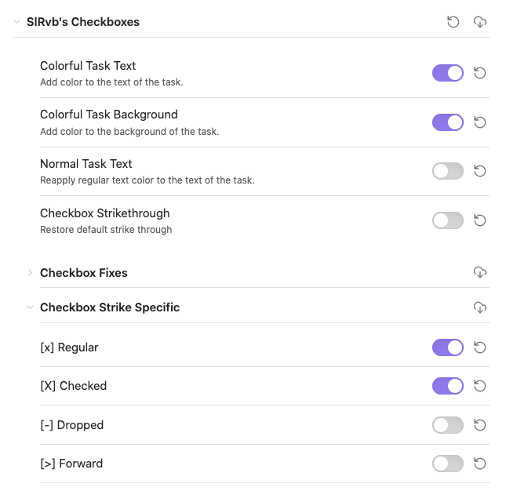

# Style custom statuses

## Summary

If you plan to use [Custom Statuses]({{ site.baseurl }}) in Tasks, you will need to install and enable **one of** the following, in order for your tasks to look good:

- A custom CSS Snippet
- A Theme

We recommend selecting a snippet rather than a theme.

This is because if you choose custom checkboxes from a theme, you are tied that theme permanently.

However, most snippets can be applied to any theme, giving you much more flexibility.

Different CSS Snippets and Themes use different letters and symbols inside `[` and `]`, so it's more efficient to select your styling first, and then [set up your custom statuses]({{ site.baseurl }}) for the symbol character your chosen styling supports.

This pages walks through downloading and using a CSS snippet to make them look good.

## Assumptions

We assume that you know how to [use CSS snippets in Obsidian](https://help.obsidian.md/How+to/Add+custom+styles#Use+Themes+and+or+CSS+snippets).

## Default appearance

Suppose we had these three tasks with custom statuses:

```text
- [!] #task Do important stuff
- [D] #task Do important stuff
- [X] #task Do important stuff ✅ 2023-01-09
```

Tasks doesn't know the meaning of any custom statuses. This means that by default, these tasks would be displayed like this:


- We intended the first two tasks to be 'not done', but they have a checkmark.
- All three tasks look like they are done, because none of them has a space in the `[]`.
- Only the one with `[X]` has a line through it. Tasks only treats lines with `[x]` or `[X]` as completed.

## Picking a custom style: SlrVb's Alternate-Checkboxes

There are many community Snippets and Themes available to customise the appearance of checkboxes in Obsidian, and different people have different preferences.

Tasks allows (and requires) you to choose your own styling option. We have a list of common ones in [Status Collections]({{ site.baseurl }})

For this example, we will choose to style our tasks with [SlRvb's Alternate Checkboxes]({{ site.baseurl }}).

## Installing SlrVb's Alternate-Checkboxes

[Download the snippet](https://github.com/SlRvb/Obsidian--ITS-Theme/blob/main/Guide/Alternate-Checkboxes.md), add it to your vault's snippet folder, and enable the snippet.

The above 3  task lines now look like this:


## Customising the custom style: Style Settings plugin

We also have the option to install the [Style Settings](https://github.com/mgmeyers/obsidian-style-settings) plugin and customise the appearance of SlrVb's Alternate Checkboxes.

- Use this link to [install the Style Settings plugin in your vault](obsidian://show-plugin?id=obsidian-style-settings)
- Enable the plugin

Now we can go to the Style Settings plugin's options:


Expand the 'SlRvb's Checkboxes' section and turn on these options:



Now the above three tasks look more colourful, and tasks with `[x]` and `[X]` are crossed out, indicating they are completed:


## Related pages

<!-- force a blank line --> <!-- include: snippet-statuses-overview.md -->

{: .info }
> Broad steps to understand and set up Statuses (or "Alternate Checkboxes"):
>
> - Understand what Statuses are:
>   - [Statuses]({{ site.baseurl }})
>   - [Custom Statuses]({{ site.baseurl }})
> - Choose your status styling scheme: this will determine the names and symbols for your custom statuses:
>   - Some common ones are shown in [Status Collections]({{ site.baseurl }})
> - Set up your status styling scheme
>   - [How to style custom statuses]({{ site.baseurl }}).
> - Configure Tasks to use your custom statuses
>   - [How to set up your custom statuses]({{ site.baseurl }})
> - Optionally, update your tasks searches to take advantage of the new flexibility
>   - [Filters for Task Statuses]({{ site.baseurl }}#filters-for-task-statuses)

<!-- force a blank line --> <!-- endInclude -->
