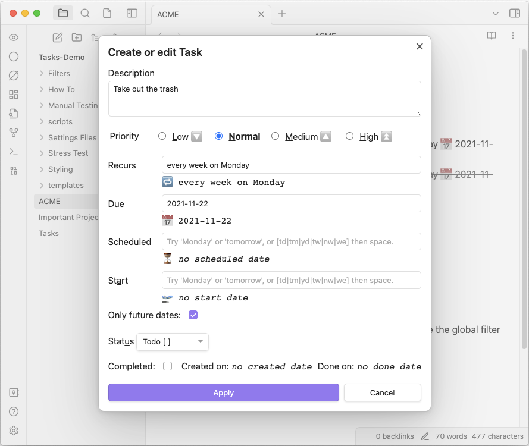

# Introduction

> [!Danger]
> This is an experimental conversion of the Tasks user docs to Obsidian Publish, tracked in [#1706](https://github.com/obsidian-tasks-group/obsidian-tasks/issues/1706).
>
> For now, please visit the [original documentation site](https://obsidian-tasks-group.github.io/obsidian-tasks/) instead.
>
> Every page here has a 'View this page on the old documentation site' section at the bottom, making it easy to compare the old and new sites side-by-side, and report and problems.
>
> For testing purposes, this site is published at [publish.obsidian.md/tasks](https://publish.obsidian.md/tasks/queries/sorting).
>
> You can read more about progress on this conversion, including known problems and remaining steps, at the [Migration to Publish](https://publish.obsidian.md/tasks/migration) page.

## Task management for the [Obsidian](https://obsidian.md/) knowledge base

Track tasks across your entire vault.
Query them and mark them as done wherever you want.
Supports due dates, recurring tasks (repetition), done dates, sub-set of checklist items, and filtering.

You can toggle the task status in any view or query and it will update the source file.

> Please submit bugs using the [Bug Report form](https://github.com/obsidian-tasks-group/obsidian-tasks/issues/new?assignees=&labels=type%3A+bug&template=bug-report.yaml).
>
> Please submit ideas using the [Feature Request form](https://github.com/obsidian-tasks-group/obsidian-tasks/issues/new?assignees=&labels=type%3A+enhancement&template=feature-request.yaml).
>
> Please ask for help in the [Q&A Discussions section](https://github.com/obsidian-tasks-group/obsidian-tasks/discussions/categories/q-a) by clicking **New discussion**.
>
> Please share any interesting or fun uses of tasks in the [Show and Tell Discussions section](https://github.com/obsidian-tasks-group/obsidian-tasks/discussions/categories/show-and-tell) by clicking **New discussion**.

For changes in each release, please check the [releases page](https://github.com/obsidian-tasks-group/obsidian-tasks/releases).

---

## Screenshots

- *All screenshots assume the global filter `#task` which is not set by default (see also "Getting Started").*
- *The theme is default Obsidian theme.*

The `ACME` note has some tasks.

The `Important Project` note also has some tasks.

The `Tasks` note gathers all tasks from the vault and displays them using queries.

The `Tasks: Create or edit` command helps you when editing a task.

---

## View this page on the old documentation site

> [!Info] Request for feedback
> This page is an experimental migration of the Tasks user docs to Obsidian Publish. When the conversion is good enough, this will become the live site.
>
> For comparison, you can view [this page on the old documentation site](https://obsidian-tasks-group.github.io/obsidian-tasks/).

> [!Bug] Please report any problems
>
> We are keeping a list of [[migration#Current Status and Known Problems|Known Problems]] with the conversion.
>
> If you notice any other problems in this page, compared to [the old one](https://obsidian-tasks-group.github.io/obsidian-tasks/), please let us know in [#1706](https://github.com/obsidian-tasks-group/obsidian-tasks/issues/1706#issuecomment-1454284835).
>
> Please include:
>
> - The URL of this problem page
> - A screenshot of the problem.
>
> Thank you!
