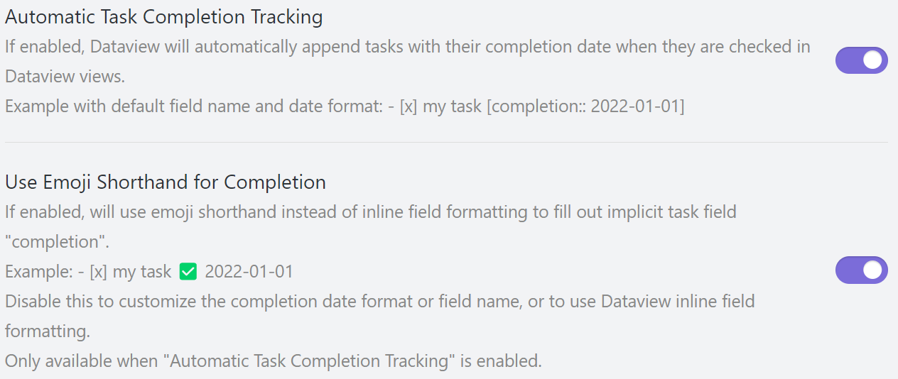

# Combining Dataview and Tasks

The [Dataview](https://github.com/blacksmithgu/dataview) plugin provides many data analysis features for Obsidian vaults, including queries about tasks.
This page only describes settings to maximize compatibility between Dataview and Tasks; for all other information on Dataview, including Dataview's names for the task emoji fields,
please see its [documentation](https://blacksmithgu.github.io/obsidian-dataview/data-annotation/#tasks).

> As of Dataview 0.5.43, all Tasks emoji fields **except recurrence** can be queried through Dataview or dataviewjs. Information is in the [Dataview documentation](https://blacksmithgu.github.io/obsidian-dataview/data-annotation/#tasks).

## Automatic Task Completion

> [!quote] Released
Introduced in Dataview 0.5.42

If you use the "Set Done Date on every completed task" option in Tasks, you can configure Dataview so that clicking a task's checkbox from a Dataview query result will add or remove the `✅ YYYY-MM-DD` completion date just like clicking the checkbox in a Task query result or using the command `Tasks: Toggle Done`.

0. Make sure Dataview is up to date by checking for updates in "Settings" -> "Community Plugins" -> "Check for Updates".
1. In "Settings" -> "Dataview", scroll down to and enable the "Automatic Task Completion" setting.
2. Just below the "Automatic Task Completion" setting, enable the "Use Emoji Shortcut for Completion" setting.
3. Close and then reopen Obsidian.

_Note: This is the Dataview settings page, not the Tasks settings page._

---

> [!warning]
> Dataview does not understand recurring tasks. Checking off a recurring task from a Dataview TASK query will add a done date but will not generate a new instance of that recurring task.
To get the correct behavior for recurring tasks from Dataview TASK query results, click the text of the task (not the checkbox) to go to the file where the task is written,
and then use the "Tasks: Toggle Done" command or click the checkbox from there.

---

## Related pages

- [[how-to/get-tasks-in-current-file|How to get all tasks in the current file]] - an example of using the Dataview plugin to generate Tasks code blocks, to do things that Tasks alone cannot do.

---

## View this page on the old documentation site

> [!Info] Request for feedback
> This page is an experimental migration of the Tasks user docs to Obsidian Publish. When the conversion is good enough, this will become the live site.
>
> For comparison, you can view [this page on the old documentation site](https://obsidian-tasks-group.github.io/obsidian-tasks/other-plugins/dataview/).

> [!Bug] Please report any problems
>
> We are keeping a list of [[migration#Current Status and Known Problems|Known Problems]] with the conversion.
>
> If you notice any other problems in this page, compared to the old one, please let us know in [#1706](https://github.com/obsidian-tasks-group/obsidian-tasks/issues/1706#issuecomment-1454284835).
>
> Please include:
>
> - The URL of the problem page
> - A screenshot of the problem.
>
> Thank you!
